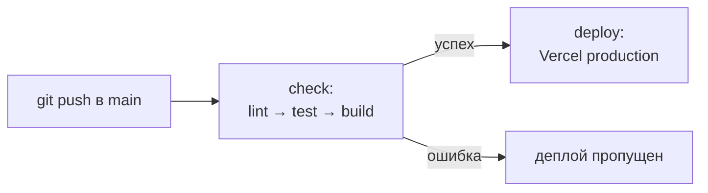
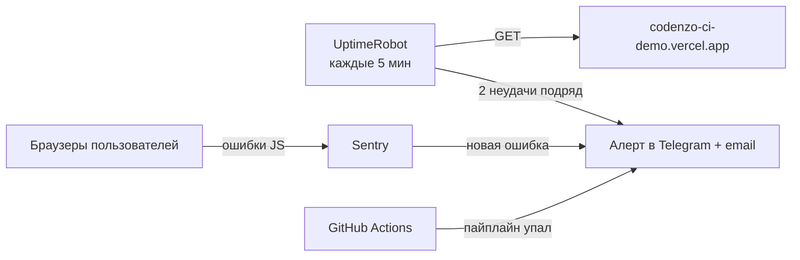

# Codenzo CI/CD demo


Тестовое задание на позицию Junior DevOps: CI/CD-пайплайн для простого
фронтенд-приложения с автоматическим деплоем на Vercel и описанием подхода
к мониторингу.

## Ссылки

- Сайт: https://codenzo-ci-demo.vercel.app
- Запуски пайплайна: https://github.com/Nikolastiq/codenzo-ci-demo/actions
- Конфигурация пайплайна: [`.github/workflows/ci-cd.yml`](.github/workflows/ci-cd.yml)

## Приложение

Шаблон Vite (чистый JavaScript) плюс небольшая функция `calculatePackagePrice`
в `src/pricing.js`: расчёт стоимости пакета занятий со скидкой (5+ занятий — 10%,
10+ — 15%). Функция нужна, чтобы у тестов был осмысленный объект проверки.
Сложность приложения здесь не главное — главное, как устроен пайплайн.

## Как устроен пайплайн

Пайплайн запускается при каждом пуше в ветку `main` и состоит из двух задач:



**Задача `check`** — проверяет код:

| Шаг | Что делает | Зачем |
|---|---|---|
| Checkout | скачивает код репозитория | раннер GitHub — чистая машина, кода на ней нет |
| Set up Node.js | ставит Node 24, включает кеш npm | та же версия, что локально, — нет сюрпризов «у меня работает» |
| `npm ci` | ставит зависимости строго по `package-lock.json` | воспроизводимая установка, в отличие от `npm install` |
| `npm run lint` | ESLint: статический анализ кода | самая быстрая проверка — первой (fail fast) |
| `npm test` | Vitest: юнит-тесты | проверяет, что код работает правильно |
| `npm run build` | сборка через Vite | проверяет, что проект вообще собирается |

**Задача `deploy`** — выкладывает сайт. Запускается только после успешной
`check` (`needs: check`): без этого задачи в GitHub Actions идут параллельно,
и деплой ушёл бы в прод даже при упавших тестах.

| Шаг | Что делает |
|---|---|
| `vercel pull` | скачивает настройки проекта с Vercel |
| `vercel build --prod` | собирает проект в формате Vercel |
| `vercel deploy --prebuilt --prod` | загружает готовую сборку и переключает production-домен |

Флаг `--prebuilt` означает, что в прод уходит ровно то, что собрал пайплайн,
а не повторная сборка на стороне Vercel.

### Проверка, что ворота работают

Запуск **#4** в [Actions](https://github.com/Nikolastiq/codenzo-ci-demo/actions)
сделан намеренно: в одном коммите изменён заголовок страницы и сломан тест.
Пайплайн остановился на шаге `Test`, задача `deploy` получила статус skipped,
на сайте остался старый заголовок. После исправления теста (запуск #5)
изменение дошло до прода.

### Секреты

Токен Vercel и ID проекта хранятся в GitHub Secrets (`VERCEL_TOKEN`,
`VERCEL_ORG_ID`, `VERCEL_PROJECT_ID`). В репозитории только ссылки на них,
в логах значения маскируются. Токен создан с отдельным именем и сроком действия.

### Защита от деплоя в обход тестов

У Vercel есть своя интеграция с GitHub, которая деплоит каждый пуш сама, не
дожидаясь тестов. Она не подключена, а в `vercel.json` автодеплой из Git
дополнительно запрещён (`git.deploymentEnabled: false`). Единственный путь
в прод — через пайплайн.

## Почему такие инструменты

- **GitHub Actions** — встроен в GitHub, бесплатен для публичных репозиториев,
  не нужно поддерживать свой раннер.
- **Vercel** — managed-хостинг, который использует Codenzo; деплой через CLI
  позволяет держать контроль над процессом в пайплайне.
- **Vitest** — нативная пара для Vite: та же конфигурация, ноль настройки.
- **ESLint** — стандартный линтер для JavaScript, рекомендованный набор правил.
- Версии Node (24) и Vercel CLI (62.1.0) закреплены, чтобы обновления
  инструментов не ломали пайплайн неожиданно.

### Осознанные компромиссы

- Проект собирается дважды (в `check` и в `deploy`): задачи выполняются на
  разных машинах, и результат сборки между ними не передаётся. Для проекта
  такого размера это секунды; на большом проекте сборку стоит передавать
  через артефакты.
- Кеш npm включён, но на маленьком проекте почти не ускоряет установку —
  выигрыш появится с ростом числа зависимостей.

## Мониторинг

Сайт статический и работает на managed-хостинге, поэтому своих серверов,
с которых нужно снимать метрики, нет. Подход — простые внешние сервисы,
каждый закрывает свой тип проблем:

| Что отслеживаем | Инструмент | Как |
|---|---|---|
| Доступность (сайт упал) | UptimeRobot | HTTP-проверка раз в 5 минут, ждём код 200 |
| Неправильное содержимое | UptimeRobot (keyword) | проверка, что на странице есть ожидаемый текст: ловит «200, но не та страница» |
| Время отклика | UptimeRobot | замер каждого запроса, алерт при превышении порога |
| Ошибки JavaScript у пользователей | Sentry | SDK во фронтенде, ошибки с привязкой к версии (commit SHA) |
| Упавший пайплайн | GitHub Actions | уведомление о неуспешном запуске |



Принципы:

- **Проверка снаружи.** UptimeRobot проверяет сайт с внешних серверов — так,
  как его видит пользователь: DNS, HTTPS, сеть и хостинг вместе.
- **Алерт после двух неудач подряд**, а не после одной — чтобы случайный
  сетевой сбой не будил команду.
- **Один канал алертов** (общий Telegram-чат команды) — на раннем этапе
  этого достаточно, без сложной эскалации.
- **Sentry привязан к версии**: в каждую ошибку передаётся SHA коммита,
  поэтому сразу видно, после какого деплоя она появилась.

Для этого задания мониторинг описан, но не развёрнут.

## Локальный запуск

Нужен Node.js 24.

```bash
npm ci
npm run lint
npm test
npm run dev      # dev-сервер на http://localhost:5173
npm run build    # сборка в dist/
```

## Что можно улучшить дальше

- Запускать `check` на pull request и запретить слияние в `main` без
  зелёного пайплайна (branch protection).
- Preview-деплои для pull request — отдельная ссылка для проверки до слияния.
- Передавать сборку между задачами через артефакты вместо повторной сборки.
- Dependabot для автоматических обновлений зависимостей и GitHub Actions.
- Не запускать деплой при изменении только документации (`paths-ignore`).
